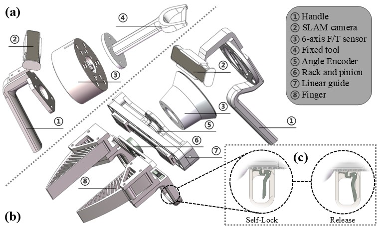

# ForceCapture

<a href='https://forcemimic.github.io/'>
  
</a>
<a href='https://arxiv.org/abs/2410.07554'>
  
</a>
<a href='https://2025.ieee-icra.org'>
  
</a>
<br/>

<!--  -->


Official implementation for ForceCapture in the paper [ForceMimic: Force-Centric Imitation Learning with Force-Motion Capture System for Contact-Rich Manipulation](https://arxiv.org/abs/2410.07554), accepted by [ICRA 2025](https://2025.ieee-icra.org).

For more information, please visit our [project website](https://forcemimic.github.io/).

---

## Hardware
Download the fixed-tool version assets from [Onshape](https://cad.onshape.com/documents/a8dc2f65bd1ae816592e5c51/w/cf0c50fb046b5fe4d6c55a08/e/2a83c3cca3f56ae2baac3a15) and print them as needed.
The force-torque sensor used here is an inner product by [Flexiv](https://www.flexiv.com/), but you can easily replace it with a commonly-used alternative, like [ATI](https://www.ati-ia.com/Products/ft/sensors.aspx).
The SLAM camera used here is [Intel RealSense T265](https://www.intelrealsense.com/tracking-camera-t265/), and the observation camera used here is [Intel RealSense L515](https://www.intelrealsense.com/lidar-camera-l515/), while they are [discontinued](https://www.intelrealsense.com/message-to-customers/). And the angle encoder used here is by [pdcd](http://www.dgpdcdkj.com/).

## Installation
```bash
git clone git@github.com:ForceMimic/forcecapture.git --recurse-submodules
cd forcecapture
# `main` branch for fixed-tool version, `git checkout gripper` to `gripper` branch for gripper version

conda create -n focap python=3.10
conda activate focap

cd r3kit
pip install -e .
cd ..

pip install -r requirements.txt
```

## Pre-collection
```bash
python tare_pyft.py --config configs/tare_pyft.txt
python test_tare_pyft.py --config configs/tare_pyft.txt
```

## Collection
```bash
python collect_data.py --config configs/collect.txt
```

> NOTE: During collection, use `htop` to watch memory usage, and use `sudo sync` and `sudo sysctl -w vm.drop_caches=3` to free memory.

## Post-collection
```bash
python visualize_data.py --config configs/visualize.txt # also be used as annotation
python create_hdf5.py --config configs/hdf5.txt
python visualize_hdf5.py --config configs/visualize_hdf5.txt
python merge_hdf5.py --config configs/merge.txt
python visualize_merge.py --config configs/visualize_merge.txt
```

---

## Acknowledgement
Our design and implementation are inspired by [DexCap](https://github.com/j96w/DexCap) and [UMI](https://github.com/real-stanford/universal_manipulation_interface). Kudos to the authors for their amazing contributions.

## Citation
If you find our work useful, please consider citing: 
```bibtex
@inproceedings{liu2025forcemimic,
  author={Liu, Wenhai and Wang, Junbo and Wang, Yiming and Wang, Weiming and Lu, Cewu},
  booktitle={2025 IEEE International Conference on Robotics and Automation (ICRA)}, 
  title={ForceMimic: Force-Centric Imitation Learning with Force-Motion Capture System for Contact-Rich Manipulation}, 
  year={2025}
}
```

## License
This repository is released under the [MIT](https://mit-license.org/) license.
